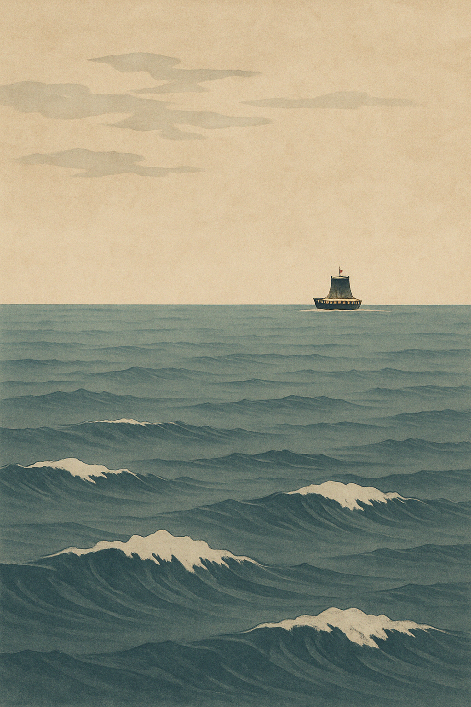
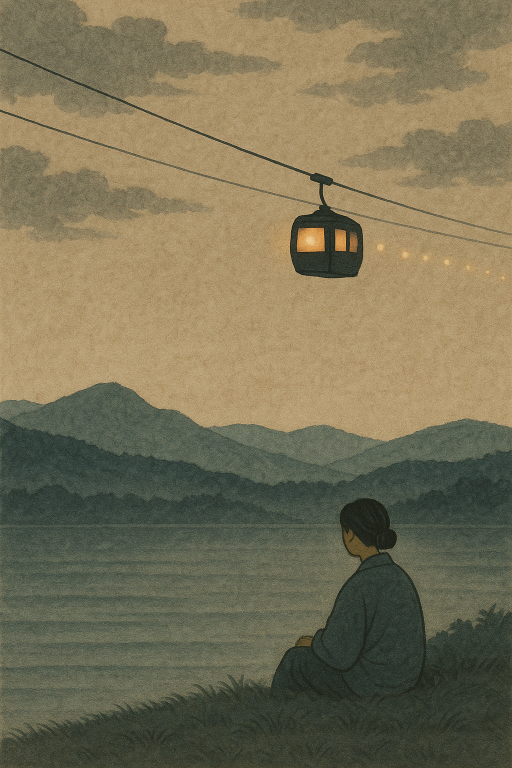

# হাইকু

জাপানি কবিতা "হাইকু" এর গঠন প্রণালীর সাথে উদ্বুদ্ধ হয়ে নিম্নে কিছু হাইকু লেখার প্রয়াস করলাম।

## হাইকু #০১&#x20;

<figure><figcaption></figcaption></figure>

নিস্তব্ধ সাগর\
ঢেউ কাঁপিয়ে গেলো বুকে\
পুনরায় শান্ত

২৬ এপ্রিল ২০২৫

(সিঙ্গাপুরের Labrador নামক একটি সদুদ্রের পাশের পার্কে লেখা)

**ইংরেজী অনুবাদ**

Silent is the sea\
A ship stirs waves in passing\
Then stillness returns

**জাপানিজ অনুবাদ**

静かな海\
船の波の声\
また静か

#### **এই হাইকুর ব্যাখ্যা:**

এই হাইকুটি খুবই সংক্ষিপ্ত, কিন্তু এর মধ্যে একটি গভীর অনুভব লুকিয়ে আছে। এটি প্রকৃতির এক ক্ষণিক দৃশ্য এবং তাতে সময়ের বহমানতা ও নিস্তব্ধতার সৌন্দর্য ফুটে উঠেছে।

**প্রথম পংক্তি:**\
“静かな海” (Shizuka na umi) —\
অর্থ: “নিঃশব্দ সমুদ্র”\
এটি একটি শান্ত ও নীরব পরিবেশকে নির্দেশ করে, যেন কিছুই ঘটছে না—সবকিছু থমকে আছে।

**দ্বিতীয় পংক্তি:**\
“船の波の声” (Fune no nami no koe) —\
অর্থ: “জাহাজের ঢেউয়ের শব্দ”\
এই অংশে হঠাৎ একটুখানি শব্দ এসে পড়ে সেই নিস্তব্ধতায়—একটি জাহাজ চলে যায়, এবং তার ফলে সৃষ্ট ঢেউয়ের আওয়াজ সেই নীরবতা ভেঙে দেয়।

**তৃতীয় পংক্তি:**\
“また静か” (Mata shizuka) —\
অর্থ: “আবার নিঃশব্দ”\
এই শব্দের ধাক্কা শেষ হওয়ার পর আবার প্রকৃতি তার মূল অবস্থায় ফিরে আসে—আবার নিস্তব্ধতা।

#### **এই হাইকুতে 'Wabi-Sabi' নন্দনতত্ত্ব:**

জাপানি ঐতিহ্যবাহী সাহিত্য ও শিল্পে ‘**Wabi-Sabi (侘寂)**’ একটি গভীর দার্শনিক ও নান্দনিক ধারণা। এটি মূলত:

* **সাধারণতা ও সরলতা (wabi)** এবং
* **অস্থায়িত্ব ও অপরিপূর্ণতার সৌন্দর্য (sabi)**\
  কে উদযাপন করে।

এই হাইকুতে—

* **নিঃশব্দতা** হল ‘wabi’—প্রকৃতির শান্ত সৌন্দর্য
* **জাহাজের তরঙ্গ ও শব্দ** হল ‘sabi’—একটি ক্ষণিকের উচ্ছ্বাস, তারপর মিলিয়ে যাওয়া

এই দৃষ্টিভঙ্গি বাংলা সাহিত্যের ‘নিসর্গচেতনা’ বা প্রকৃতির সাথে একাত্ম বোধের সাথে মিলে যায়। যেমন রবীন্দ্রনাথ, জীবনানন্দ কিংবা জসীমউদ্দিন—তাঁদের লেখাতেও এই ধরণের মুহূর্তগুলো পাওয়া যায়। এই হাইকুটি খুব ছোট হলেও এটি আমাদের শেখায়— কীভাবে একটুখানি শব্দ প্রকৃতির নিস্তব্ধতা ভেঙে দিতে পারে, আবার কীভাবে প্রকৃতি তার নিজস্ব শান্তিতে ফিরে আসে এবং এই ক্ষণস্থায়ী পরিবর্তনের মধ্যেও এক ধরনের চিরন্তনতা লুকিয়ে থাকে

এটি আমাদের স্মরণ করিয়ে দেয়—জীবন ঠিক এমনই: মাঝে মাঝে ঢেউ ওঠে, আবার সব কিছু শান্ত হয়ে যায়। তাই এই হাইকু শুধুই প্রকৃতির বর্ণনা নয়, বরং জীবনের একটি দর্শন।

## হাইকু #০২

<figure><figcaption></figcaption></figure>

জোনাকির মতন রোপওয়ের আলো\
যাচ্ছে সবাই এপার ওপার\
আমি বসে ভাবছি তোমায়

**ইংরেজী অনুবাদ:**

Cable car light glows\
like a firefly through the dark\
I sit, thinking you

**জাপানিজ অনুবাদ**

ロープウェイ\
蛍のような灯\
君を想う

২৬ এপ্রিল ২০২৫\
(সিঙ্গাপুরের Labrador নামক একটি সদুদ্রের পাশের পার্কে লেখা)

ব্যাখ্যা:\
এই হাইকুটির মধ্যে আছে—

* দৃশ্য (visual imagery): রাতের অন্ধকারে রোপওয়ের আলো একেকটা জোনাকির মতো দেখা যাচ্ছে।
* গতি ও নিরবতা (movement vs. stillness): সবাই যাচ্ছে ওপারে, কিন্তু কবি বসে আছেন চুপচাপ।
* মানসিক অনুভব (emotion): প্রিয়জনের কথা ভাবছেন; স্মৃতির সঙ্গে প্রকৃতির দৃশ্য মিলেমিশে এক হয়ে যাচ্ছে।

১ম পঙক্তি: “জোনাকির মতন রোপওয়ের আলো”: এখানে একটি অদ্ভুত সুন্দর দৃশ্য আঁকা হয়েছে—আকাশে চলা একটি রোপওয়ে, যার আলোগুলি মনে হচ্ছে যেন জোনাকি। এটি প্রকৃতি ও প্রযুক্তির মিলন। জোনাকি একটি প্রাণ, কিন্তু আলো দিয়ে সে মুগ্ধ করে, আর এখানেও সেই জ্যোতির ছায়া। এটি শৈল্পিক উপমা (simile) দিয়ে সাজানো, যা জাপানি হাইকুতে খুব সাধারণ — যেমন গোধূলির মেঘকে তুলনা করা হয় পাখির ডানার সঙ্গে।

২য় পঙক্তি: “যাচ্ছে সবাই এপার ওপার”: এখানে গতি ও প্রবাহ আছে। মানুষ রোপওয়ে ধরে এক দিক থেকে অন্য দিকে যাচ্ছে। এটি জীবনের গতি, সময়ের প্রবাহ বা হয়তো মানুষের যাত্রার প্রতিচ্ছবি। কবির নিজেকে ছিন্ন করে রাখা, এই প্রবাহ থেকে আলাদা রাখা, খুবই গভীর বোধ তৈরি করে।

৩য় পঙক্তি: “আমি বসে ভাবছি তোমায়”: সকল কোলাহল ও গতির মাঝেও, কবি স্থির। বসে আছেন। কিন্তু ভিতরে চেতনাস্রোতে চলমান — তিনি ভাবছেন "তোমায়"। এটি প্রেমের বা স্মৃতির গভীর প্রকাশ। জাপানি হাইকুতে এই ধরণের "অন্তর্মুখীনতা" খুবই পরিচিত এক আবেগ।

